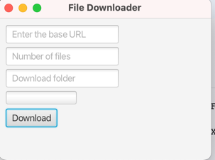

# File Downloader JavaFX Application

This is a simple JavaFX application that allows users to download multiple files from a base URL. 

## Features

* Downloads multiple files sequentially.
* Customizable base URL, file numbering format, and download folder.
* Displays a progress bar to track the download progress.
* Creates the download folder if it doesn't exist.

## How to Use

1. **Enter the Base URL:** 
   Provide the URL of the first file in the sequence. For instance, if the first file's URL is `https://example.com/files/01.mp3?_=1`, then this should be entered in the "Enter the base URL" field. The application will automatically replace "01.mp3?_=1" with the appropriate file number. 
2. **Specify the Number of Files:** 
   Enter the total number of files you want to download in the "Number of files" field.
3. **Choose the Download Folder:** 
   Specify the path to the folder where you want to save the downloaded files in the "Download folder" field.
4. **Click "Download":**
   The application will start downloading the files and display the progress in the progress bar.

## Example

To download files named 01.mp3, 02.mp3, ..., 10.mp3 from `https://example.com/files/`, you would:

1. Enter `https://example.com/files/01.mp3?_=1` in the "Enter the base URL" field.
2. Enter `10` in the "Number of files" field.
3. Enter the desired download folder path, for example, `C:\Downloads\`.
4. Click "Download".

## Note

* The application currently assumes a specific file naming convention where files are numbered sequentially (e.g., 01.mp3, 02.mp3, etc.). You might need to modify the code if your files follow a different naming pattern.
* The application uses a simple sequential download approach. For large numbers of files or very large files, consider implementing more advanced techniques like multi-threaded downloads for better performance.

## Screenshot

 

